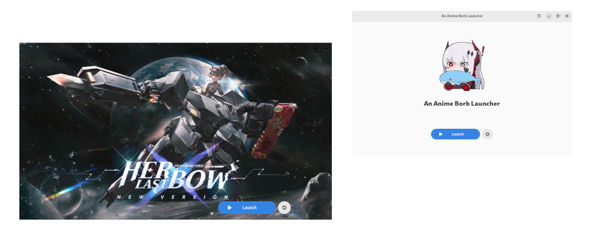

<picture>
    <source media="(prefers-color-scheme: dark)" srcset="repository/logo-dark.png">
    
</picture>

<br>

<p align="center">
    <a href="https://discord.gg/ck37X6UWBp">Discord</a> ·
    <a href="https://matrix.to/#/#an-anime-game:envs.net">Matrix</a> ·
    <a href="https://github.com/an-anime-team/an-anime-borb-launcher/wiki">Wiki</a>
</p>

<br>

<h1 align="center">
    ❗ Launcher is not actively maintained ❗
</h1>

We do not actively maintain this launcher and don't provide any official support for related issues.

You could try running [Babylonia-terminal](https://github.com/ALEZ-DEV/Babylonia-terminal), a CLI launcher, instead.

<br>
<br>

# ♥️ Useful links

* [Wiki](https://github.com/an-anime-team/an-anime-borb-launcher/wiki) contains some basic FAQ, installation instructions and more
* [Releases page](https://github.com/an-anime-team/an-anime-borb-launcher/releases) where you can find latest available version
* [Changelog](CHANGELOG.md) with chronology of the project

<br>

# ⬇️ Download

| Distribution | Format | Wiki | Source |
| - | - | - | - |
| Fedora | Flatpak | [link](https://github.com/an-anime-team/an-anime-borb-launcher/wiki/Installation#-any-distribution-flatpak) | - |

To see the installation guides, please visit the wiki page [here](https://github.com/an-anime-team/an-anime-borb-launcher/wiki/Installation)

<br>

# 💻 Development

| Folder | Description |
| - | - |
| src | Rust source code |
| assets | App assets folder |
| assets/locales | App localizations |
| target/release | Release build of the app |

## Clone repo

```sh
git clone --recursive https://github.com/an-anime-team/an-anime-borb-launcher
```

## Run app

```sh
cargo run
```

## Build app

```sh
cargo build --release
```

## Updates strategy

Starting from 3.2.1 ([fcab428](https://github.com/an-anime-team/an-anime-borb-launcher/commit/fcab428cb40b1457f41e0856f9d1e1473acbe653)) we have 2 branches: stable ([main](https://github.com/an-anime-team/an-anime-borb-launcher/tree/main)) and dev ([next](https://github.com/an-anime-team/an-anime-borb-launcher/tree/next)). Code changes will be pushed into dev branch and merged into stable once they're ready for new version release


